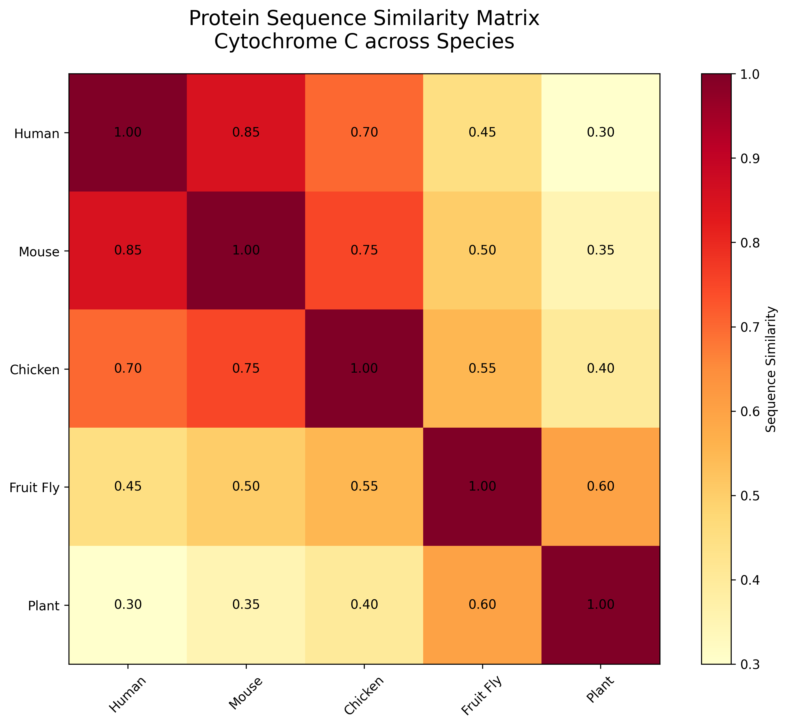
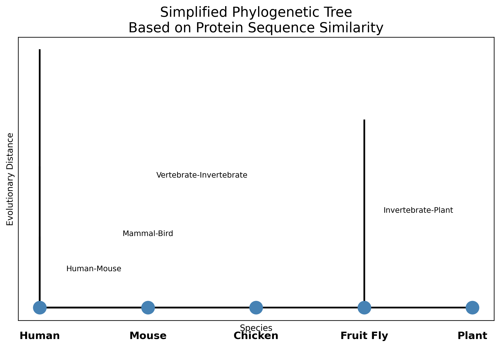

# Protein Sequence Analysis Demo
## Project Overview
This is a computational biology demonstration project that performs protein sequence similarity analysis and phylogenetic tree construction across multiple species.
## Key Results

### 1. Protein Sequence Similarity Heatmap

### 2. Simplified Phylogenetic Tree

## Methodology
1. Data Simulation: Created a similarity matrix for Cytochrome C protein across five species.
2. Distance Calculation: Converted similarity scores to evolutionary distances.
3. Phylogenetic Analysis: Constructed evolutionary relationships using hierarchical clustering principles.
4. Visualization: Generated heatmap and phylogenetic tree visualizations.

## How to Run
\`\`\`bash
python protein_analysis.py
\`\`\`

## Files
- protein_analysis.py - Main analysis script
- protein_similarity_heatmap.png - Similarity heatmap
- simplified_phylogenetic_tree.png - Phylogenetic tree
- README.md - This file
- requirements.txt - Python dependencies

## Author
[Your Name] - Undergraduate student at Hong Kong Baptist University.
